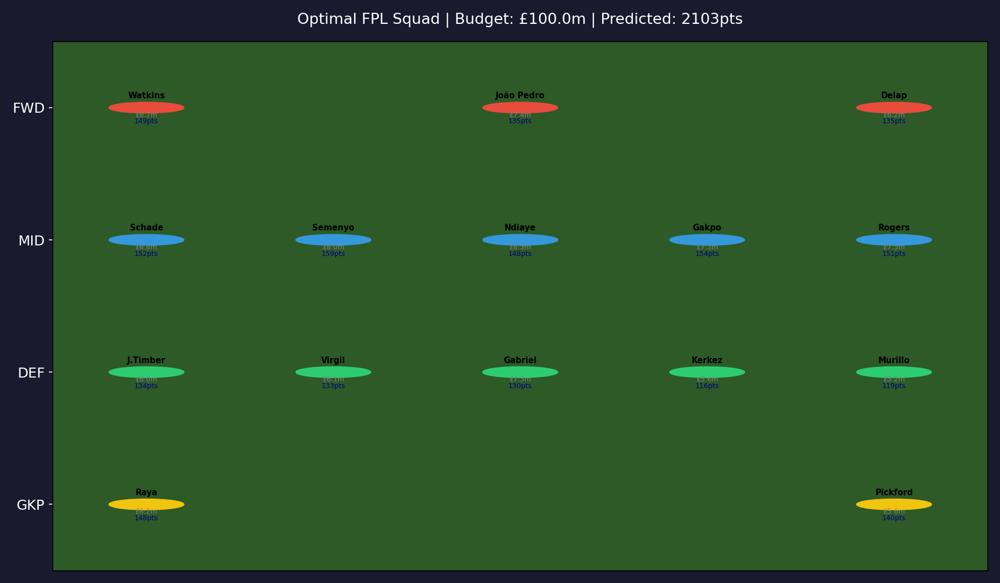
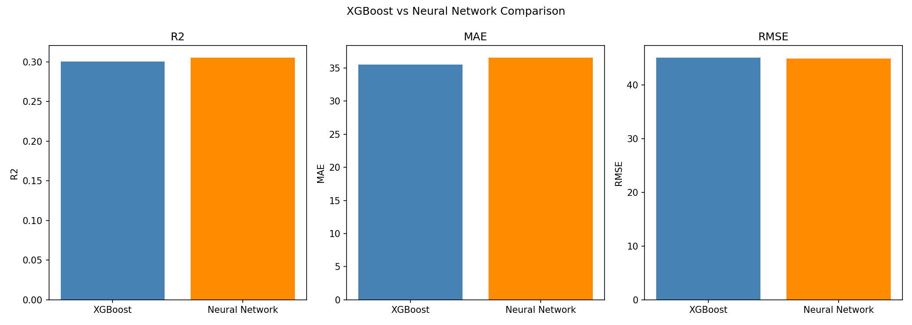
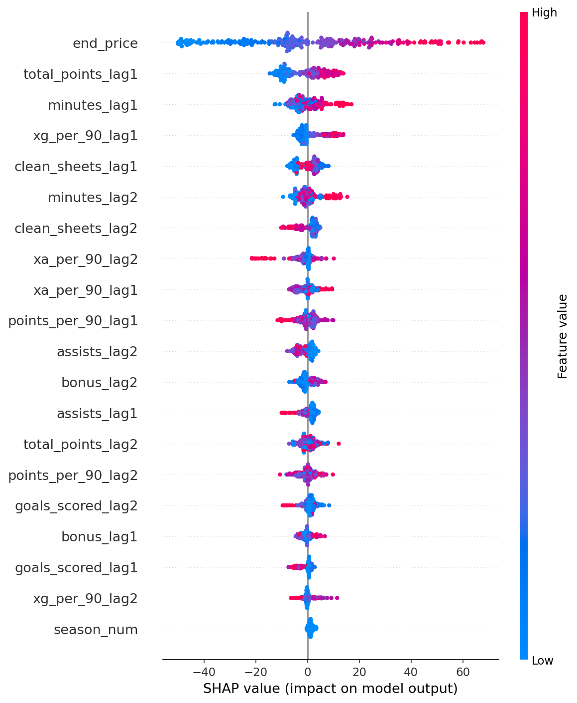

# Fantasy Premier League Team Optimisation Using Machine Learning and Linear Programming

> An AI system that predicts Fantasy Premier League player points using XGBoost and Neural Networks, then selects the optimal squad using Integer Linear Programming.

---

## Overview

Fantasy Premier League (FPL) is a game played by over 11 million managers worldwide. Each manager selects 15 real Premier League players within a £100m budget and earns points based on their real match performances.

This project builds an end-to-end AI pipeline that:
1. Fetches player data from the official FPL API
2. Engineers predictive features from historical seasons
3. Trains an XGBoost and a Neural Network model to predict player points
4. Selects the optimal 15-player squad using Integer Linear Programming

---

## Project Structure

projects-aditya-dhruv/
│
├── notebooks/
│ ├── 01_data_collection.ipynb # FPL API data fetching
│ ├── 02_eda.ipynb # Exploratory data analysis
│ ├── 03_feature_engineering.ipynb # Feature creation and lag features
│ ├── 04_xgboost_model.ipynb # XGBoost regression model
│ ├── 05_neural_network.ipynb # MLP Neural Network model
│ └── 06_squad_optimisation.ipynb # ILP squad selection
│
├── data/
│ ├── raw/ # Raw API responses
│ └── processed/ # Cleaned CSVs and plots
│
├── models/
│ ├── xgb_fpl.pkl # Trained XGBoost model
│ └── nn_fpl.keras # Trained Neural Network model
│
├── src/
│ └── init.py
│
├── requirements.txt
└── README.md


---

## Quickstart

### 1. Clone the repository
```bash
git clone https://github.com/ACM40960/projects-aditya-dhruv.git
cd projects-aditya-dhruv
```

### 2. Create virtual environment
```bash
py -3.11 -m venv venv
venv\Scripts\activate        # Windows
source venv/bin/activate     # Mac/Linux
```

### 3. Install dependencies
```bash
pip install -r requirements.txt
```

### 4. Run notebooks in order
Open each notebook in VSCode or Jupyter and run all cells:

01_data_collection.ipynb
02_eda.ipynb
03_feature_engineering.ipynb
04_xgboost_model.ipynb
05_neural_network.ipynb
06_squad_optimisation.ipynb


---

## Methodology

### Data
- Source: [Fantasy Premier League API](https://fantasy.premierleague.com/api/bootstrap-static/)
- 5 seasons of historical data (2021/22 to 2025/26)
- ~700 players, ~2000 season records

### Features
- Lag features: previous 1 and 2 season points, minutes, goals, assists
- Per-90 metrics: xG, xA, goals, assists, saves
- Price efficiency: points per million
- Position encoding, season number

### Models
| Model | R2 | MAE | RMSE |
|---|---|---|---|
| XGBoost | 0.300 | 35.50 | 45.05 |
| Neural Network (MLP) | see notebook | see notebook | see notebook |
| Ensemble (average) | used for squad selection | - | - |

### Squad Optimisation
- Integer Linear Programming via PuLP
- Constraints: £100m budget, 2 GKP / 5 DEF / 5 MID / 3 FWD, max 3 per club
- Objective: maximise ensemble predicted points

---

## Results

Optimal squad selected within £100m budget with total predicted points of **2102.9**.



### Model Comparison


### SHAP Feature Importance (XGBoost)


---

## Dependencies

- Python 3.11
- pandas, numpy, scikit-learn
- xgboost
- tensorflow / keras
- pulp (ILP solver)
- shap (model interpretability)
- matplotlib, seaborn

See [requirements.txt](requirements.txt) for full list.

---

## Authors

- Aditya Upasani
- Dhruv (contributor)

ACM 40960 — University College Dublin — Summer 2026
